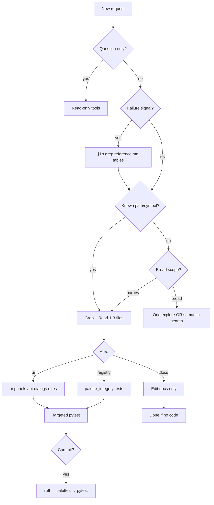

# Agent Triage — Reference

**Repo routing index:** [AGENTS.md](../../AGENTS.md). **Always-on wrapper:** [agent-routing.mdc](../../rules/agent-routing.mdc).

Quick lookup for path→test mapping and entry points. Source of truth for hooks: `scripts/pre-commit-pytest.sh`.

**Governance parity:** when editing `AGENTS.md`, agent/kanban skills or rules → [Consistency matrix](#consistency-matrix) + [agent-consistency.mdc](../../rules/agent-consistency.mdc) + [agent-self-evaluation/SKILL.md](../agent-self-evaluation/SKILL.md) §6g. **Drift alert format:** [§ Drift alert examples](#drift-alert-examples) (five prefixes; optional `[severity]`). **Periodic audit:** [kanban-markdown/SKILL.md](../kanban-markdown/SKILL.md) § Periodic AGENTS.md governance audit — user runs `python3 scripts/create_governance_audit_card.py`.

## Consistency matrix

Which artifacts must agree after a governance change. **Notes** are grep targets — do not copy full lifecycle or Fix pattern prose here. Checklist detail: [agent-consistency.mdc](../../rules/agent-consistency.mdc). End-of-turn: self-eval §6g.

| Artifact | Must match | Notes |
| -------- | ---------- | ----- |
| [AGENTS.md](../../AGENTS.md) **Every turn** | [agent-triage/SKILL.md](SKILL.md) §1/§1b, [agent-routing.mdc](../../rules/agent-routing.mdc) lifecycle | Steps `1`–`5`, `1b`; Classify quickly rows |
| [agent-routing.mdc](../../rules/agent-routing.mdc) | AGENTS.md turn lifecycle, card types | `START →` block; discovery budget |
| [agent-triage/SKILL.md](SKILL.md) | AGENTS.md Classify + Every turn | §1 ↔ Classify quickly; [reference.md](reference.md) § Classify mirror |
| [agent-self-evaluation/SKILL.md](../agent-self-evaluation/SKILL.md) §7 handoff | AGENTS.md End handoff, [agent-self-evaluation.mdc](../../rules/agent-self-evaluation.mdc) | `### Files used`, `### Self-evaluation` fields |
| [agent-self-evaluation/reference.md](../agent-self-evaluation/reference.md) § Common failure patterns | Rules (**Signature** only), § Failure pattern routing below, [testing.mdc](../../rules/testing.mdc) | Five columns per §6f |
| [pre-commit-workflow/reference.md](../pre-commit-workflow/reference.md) § Failure patterns | [targeted-testing/reference.md](../targeted-testing/reference.md), testing.mdc `precommit-*` | Area hook patterns |
| [kanban-markdown/SKILL.md](../kanban-markdown/SKILL.md) card sections | `kanban-*.mdc`, AGENTS.md card types table | `bug`, `inquiry`, `commit-issue`, `agent`, feature; **QA follow-up** refreshes **Feature Areas** / **Label Paths** / **Label Methods** when scope changes; **Lessons captured**; **Label Paths** + **Label Methods** when Feature Areas / Feature Area set |
| [docs/development.md](../../docs/development.md) Cursor agent workflow | AGENTS.md, agent-consistency.mdc | When user-facing agent docs change |

### Four check types → matrix rows

| Check type | Grep / compare |
| ---------- | -------------- |
| **Schema** | `reference.md` § Failure patterns columns; rules cite Signature not Fix pattern |
| **Routing** | AGENTS.md Every turn ↔ triage §1/§1b ↔ agent-routing.mdc |
| **Card-type** | AGENTS.md `labels` table ↔ kanban-markdown § ↔ each `kanban-*.mdc` |
| **Failure-pattern** | Signature in rule/triage exists in a reference row; docs/development.md mentions patterns when hook workflow changes |
| **Registry** | `docs/feature-areas.yaml` **Agent Workflow** `paths` ↔ AGENTS.md area → skills & rules; `handlers:` malformed/duplicate symbols; kanban **Label Methods** ↔ registry `handlers:`; periodic audit **Area table** |

## Drift alert examples

Named warning lines for governance parity (epic **GovernanceDriftAlerts**). **Surfacing:** Context load §2b check 5, self-eval §6g, handoff `- **Drift alerts:**` when governance paths edited and parity not fixed — [agent-triage/SKILL.md](SKILL.md) § Governance drift detection. **Not every turn.**

| Prefix | Check type | Anchor (matrix / audit) | Example |
| ------ | ---------- | ----------------------- | ------- |
| `Schema drift alert:` | **Schema** | [agent-self-evaluation/reference.md](../agent-self-evaluation/reference.md) § Common failure patterns — five columns per §6f | `Schema drift alert:` New Signature `ui-dialog-persist` — add row to reference § Common failure patterns and triage § Failure pattern routing |
| `Routing drift alert:` | **Routing** | AGENTS.md Every turn / Classify ↔ triage §1/§1b ↔ agent-routing.mdc; audit **Routing** | `Routing drift alert:` AGENTS Classify row "Agent handoff" missing in triage §1 |
| `Card-type drift alert:` | **Card-type** | AGENTS card types ↔ `kanban-*.mdc` ↔ kanban-markdown; audit **Card types** | `Card-type drift alert:` Frontmatter label `refactor` on card — add AGENTS card types row + `kanban-refactor-cards.mdc` |
| `Failure-pattern drift alert:` | **Failure-pattern** | Signature in rule or triage exists in a reference row; audit **Failure patterns** | `Failure-pattern drift alert:` Rule cites `precommit-palette-top-texture` — no row in pre-commit-workflow or self-eval reference |
| `Registry drift alert:` | **Registry** | `docs/feature-areas.yaml` **Agent Workflow** `paths` ↔ AGENTS area → skills & rules; `handlers:` malformed/duplicate; kanban **Label Methods** ↔ registry; audit **Area table** | `Registry drift alert:` handler `MainWindow._foo` listed in both **Area A** and **Area B** |

**Use:** paste one line per mismatch when comparing artifacts (manual grep, `python3 scripts/check_governance_parity.py`, or audit findings). Do not invent prefixes outside this table.

### Drift severity (optional prefix)

Severity is **optional** on hand-written lines — **default `warn`** when omitted (backward compatible with phase 1–3 examples above).

| Severity | When to use | Example |
| -------- | ----------- | ------- |
| `info` | Cosmetic / low-impact doc drift; user acknowledged | `[info] Registry drift alert:` AGENTS Maintaining link text differs from kanban skill — align wording |
| `warn` | **Default** — routing, card-type, registry parity not fixed same turn | `[warn] Routing drift alert:` AGENTS Classify row "Agent handoff" missing in triage §1 |
| `critical` | Broken Signature cites, schema violations, handoff blockers | `[critical] Failure-pattern drift alert:` Rule cites `orphan-sig` — no reference row |

`check_governance_parity.py` emits `[severity]` by default (`--plain` for phase 1–3 format). Script mapping: routing/card-type/registry → `warn`; failure-pattern → `critical`. **Spawn:** by default writes one **todo** kanban card per new issue (epic `GovernanceDriftAlert`; priority `low|medium|high` from severity) with **## Alert**, **## Feature Areas**, **## Label Paths**, **## Corrective Action** — `--no-spawn-cards` to disable; skips duplicate **## Alert** text.

### KNOWN_DRIFT (temporary waiver)

When the **user** approves intentional temporary drift, suppress fix-in-same-turn and record:

```text
KNOWN_DRIFT: <artifact pair> — <reason>[; expires: <YYYY-MM-DD or note>]
```

| Field | Required | Example |
| ----- | -------- | ------- |
| **artifact pair** | yes | `AGENTS Classify ↔ triage §1` |
| **reason** | yes | `phase 4 card in review — classify row lands next commit` |
| **expires** | no | `; expires: 2026-07-01` or `; expires: after governance-drift-severity phase 4 done` |

Place in handoff `- **Drift alerts:**` as `KNOWN_DRIFT: …` (no `[severity]` bracket). Do not use for silent drift — user must approve.

## Classify the request (signals)

**Canonical:** [AGENTS.md](../../AGENTS.md) § Classify quickly. [SKILL.md](SKILL.md) §1 mirrors it; failure signals → §1b + § Failure pattern routing below.

| Signal | Mode | First action (short) |
| ------ | ---- | -------------------- |
| Kanban card / implement from card | Review first → implement | kanban-markdown + card |
| Review QA issue / user screenshot fix | Surgical / Review | kanban-review-qa.mdc + **QA follow-up** + refresh **Feature Areas** / **Label Paths** / **Label Methods** when scope changes |
| User says card Done / closed | Governance | kanban-markdown § Card Done — lessons learned |
| AGENTS.md governance audit | Read-only | kanban-markdown § Periodic AGENTS.md governance audit |
| Explain / audit / is this correct? | Read-only | Grep + read |
| One error, lint, typo, ad-hoc bug | Surgical | Grep → 1–3 files |
| Multi-file feature (no card) | Implementation | repo-map + reference |
| Pre-commit failed | Unblock / Review | §1b pre-commit + self-eval reference |
| Failing test / pytest / ruff / lint | Surgical / Unblock | §1b failure pattern routing |
| UI wiring / dialog not persisting | Surgical | §1b `ui-dialog-no-persist` |
| Orbit 3D holes / transparent partial blocks | Surgical | §1b `orbit-stair-mask-transparency` |
| Agent handoff / process mistake | Surgical | §1b self-eval reference patterns |
| Repeated mistake / churn | Grep | §1b failure pattern routing |
| Run tests / commit-ready | Verify | targeted-testing / pre-commit-pytest.sh |

Ad-hoc bugs → **Surgical**. Named **To Do** card → [kanban-markdown](../kanban-markdown/SKILL.md). **Bug** cards: [kanban-bug-cards.mdc](../../rules/kanban-bug-cards.mdc). **Inquiry** cards: research + **Response** — [kanban-inquiry-cards.mdc](../../rules/kanban-inquiry-cards.mdc).

## Failure pattern routing (grep on signals only)

Run after §1 classifies a **failure** — not on every turn. Grep **Trigger snippet** or **Signature** in the listed `reference.md` § Failure patterns table; apply **Fix pattern** before deep exploration. Schema: [agent-self-evaluation/SKILL.md](../agent-self-evaluation/SKILL.md) §6f. Procedure: [agent-triage/SKILL.md](SKILL.md) §1b.

| Failure signal (§1 classify) | Grep in | Example signatures / trigger snippets |
| ---------------------------- | ------- | --------------------------------------- |
| Pre-commit / hook / ruff / palette validate | [pre-commit-workflow/reference.md](../pre-commit-workflow/reference.md) § Failure patterns | `precommit-stash-old-hooks`, `precommit-pytest-scope-mismatch`, `validate-palettes`, `ruff` |
| Pytest scope / hook surprise / hardcoded counts | [pre-commit-workflow/reference.md](../pre-commit-workflow/reference.md) + [agent-self-evaluation/reference.md](../agent-self-evaluation/reference.md) § Common failure patterns | `precommit-pytest-scope-mismatch`, `palette-hardcoded-count`, `FAILED tests/` |
| UI wiring / dialog / persist | [agent-self-evaluation/reference.md](../agent-self-evaluation/reference.md) § Common failure patterns | `ui-dialog-no-persist`, `_persist_dialog_changes` |
| Orbit 3D holes / transparent stairs | [agent-self-evaluation/reference.md](../agent-self-evaluation/reference.md) § Common failure patterns | `orbit-stair-mask-transparency`, `test_orbit_stair_face_textures_are_opaque` |
| Worldgen / placement / functional blocks | [agent-self-evaluation/reference.md](../agent-self-evaluation/reference.md) + `.cursor/rules/worldgen.mdc` | `residence` stage 1 for chest NBT tests (see worldgen rule) |
| Agent handoff / kanban / AGENTS.md / self-eval | [agent-self-evaluation/reference.md](../agent-self-evaluation/reference.md) § Common failure patterns | `self-eval-skipped`, `kanban-roadmap-queue`, `agents-md-stale`, `handoff-missing-files-context` |
| Structure YAML paths | [agent-self-evaluation/reference.md](../agent-self-evaluation/reference.md) § Common failure patterns | `yaml-stage1-structure-yaml`, `stage1/structure.yaml` |

**No match:** proceed with normal discovery; note recurring failures for self-eval §6 churn.

### Example — pre-commit failure

```text
User: commit failed on pytest; no commit-issue card in .devtool/features/

1. Classify → Unblock / pre-commit failed
2. Grep:
     rg "commit-issue|precommit-stash|FAILED" .cursor/skills/pre-commit-workflow/reference.md
     rg "precommit-" .cursor/skills/agent-self-evaluation/reference.md
3. Match precommit-stash-old-hooks → stage hook scripts + pre-commit install
4. Else match precommit-pytest-scope-mismatch → scripts/pre-commit-pytest.sh on staged paths
5. Open pre-commit-workflow/SKILL.md for hook order; commit-issue card rule if capture expected
```

## Entry points

| Concern | Module / doc |
| ------- | ------------- |
| Render pipeline | `render_main.py` → `renderers/registry.py` |
| Structure load/save | `helpers/structure_loader.py`, `ui/document.py` |
| Block registry | `registries/loader.py`, `helpers/registry_lookup.py` |
| Palette / picker UI | `helpers/block_picker.py`, `ui/widgets/palette_panel.py` |
| Grid editing | `ui/widgets/grid.py`, `ui/main_window.py` (orchestration) |
| Site / paths | `helpers/path_geometry.py`, `helpers/site_ground.py`, `ui/widgets/site_grid.py` |
| Worldgen export | `renderers/worldgen.py`, `helpers/worldgen_*.py` |
| Token grammar | `helpers/structure_tokens.py`, `docs/structure-tokens.md` |

## Common path → pytest mapping

Use `.venv/bin/pytest … -q` from repo root.

| Changed path(s) | Start with |
| --------------- | ---------- |
| `helpers/cells.py` | `tests/test_cells.py` |
| `helpers/block_picker.py`, `helpers/registry_*.py` | `tests/test_block_picker.py`, `tests/test_palette_integrity.py` |
| `helpers/materials.py` | `tests/test_materials.py` |
| `helpers/structure_loader.py`, `helpers/structure_tokens.py` | `tests/test_structure_loader.py`, `tests/test_structure_tokens.py` |
| `helpers/path_geometry.py`, `helpers/path_strip.py` | `tests/test_path_geometry.py`, `tests/test_path_strip.py` |
| `registries/**` | `tests/test_palette_integrity.py`, `tests/test_registry_phase_b.py` |
| `ui/document.py`, `ui/editor_*.py` | `tests/test_ui_document.py` |
| `ui/widgets/palette_panel.py` | `tests/test_palette_panel.py` |
| `ui/widgets/grid.py` | `tests/test_grid_scrollbars.py` + grid-related tests |
| `ui/main_window.py` | `tests/test_main_window.py` |
| `renderers/worldgen.py`, `helpers/worldgen_*.py` | `tests/test_worldgen_*.py` (see pre-commit script list) |
| `helpers/paths.py`, `helpers/structure_loader.py` | `tests/test_paths.py`, `tests/test_structure_loader.py`, `tests/test_worldgen_functional_blocks.py` |
| `docs/**` only | *(none)* |

When in doubt, grep `scripts/pre-commit-pytest.sh` for the file you changed.

## Before commit

Run `scripts/pre-commit-pytest.sh` on **staged** files — same script as the hook. After fixing a failure, re-run that script (or full suite if it says full suite), not only the single failed test file. See [targeted-testing](../targeted-testing/SKILL.md) §5–§6.

## Forces full pytest suite (pre-commit)

These staged paths trigger **full suite** in the hook:

- `tests/conftest.py`, `pyproject.toml`, `render_main.py`
- `helpers/context.py`, `registries/loader.py`, `helpers/utils.py`

## UI file size hints

| File | Note |
| ---- | ---- |
| `ui/main_window.py` | Orchestration only — grep for handler name; avoid full read |
| `ui/widgets/grid.py` | Large — read targeted line ranges |
| `ui/document.py` | Manifest + stage save logic |

## Qt tests

PySide6 tests may segfault in sandboxed shells. If pytest dies with SIGSEGV on UI tests, rerun with full permissions or run the specific UI test file locally.

## Decision flow


