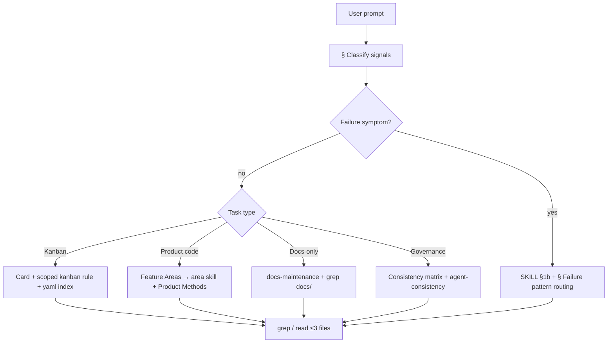
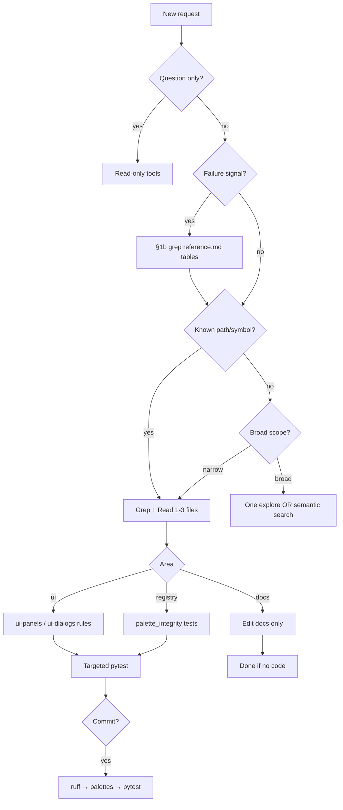

# Agent Triage — Reference

**Repo routing index:** [AGENTS.md](../../AGENTS.md). **Always-on wrapper:** [agent-routing.mdc](../../rules/agent-routing.mdc).

Quick lookup for path→test mapping and entry points. Source of truth for hooks: `scripts/pre-commit-pytest.sh`.

**Governance parity:** when editing `AGENTS.md`, agent/kanban skills or rules → [Consistency matrix](#consistency-matrix) + [agent-consistency.mdc](../../rules/agent-consistency.mdc) + [agent-self-evaluation/SKILL.md](../agent-self-evaluation/SKILL.md) §6g. **Drift alert format:** [§ Drift alert examples](#drift-alert-examples) (seven prefixes; optional `[severity]`). **Periodic audit:** [kanban-markdown/SKILL.md](../kanban-markdown/SKILL.md) § Periodic AGENTS.md governance audit;
checklist detail in [kanban-markdown/reference.md](../kanban-markdown/reference.md) — user runs
`python3 scripts/create_governance_audit_card.py`.

## Consistency matrix

Which artifacts must agree after a governance change. **Notes** are grep targets — do not copy full lifecycle or Fix pattern prose here. Checklist detail: [agent-consistency.mdc](../../rules/agent-consistency.mdc). End-of-turn: self-eval §6g.

| Artifact | Must match | Notes |
| -------- | ---------- | ----- |
| [AGENTS.md](../../AGENTS.md) **Every turn** | [agent-triage/SKILL.md](SKILL.md) §1/§1b, [agent-routing.mdc](../../rules/agent-routing.mdc) lifecycle | Steps `1`–`6`; Classify quickly ≤5-row summary; Maintaining → [agent-consistency.mdc](../../rules/agent-consistency.mdc) (acb3) |
| [agent-routing.mdc](../../rules/agent-routing.mdc) | AGENTS.md turn lifecycle, card types | `START →` block; discovery budget; product rules glob-scoped (acb2 — Signature: `governance-always-on-rule-diet`) |
| [agent-triage/SKILL.md](SKILL.md) | AGENTS.md Every turn; [reference.md](reference.md) § Classify | §1 pointer only; § Lessons by area |
| [agent-self-evaluation/SKILL.md](../agent-self-evaluation/SKILL.md) §7 handoff | AGENTS.md End handoff, [agent-self-evaluation.mdc](../../rules/agent-self-evaluation.mdc) | Compact one-line fields; AGENTS/mdc **pointer only** — gc4 Signature `governance-compact-self-eval-handoff`; gc7 `check_handoff_duplication_pair` flags ≥3 consecutive duplicated field lines — Signature `governance-gc7-handoff-duplication-pair` |
| [agent-self-evaluation/reference.md](../agent-self-evaluation/reference.md) § Common failure patterns | Rules (**Signature** only), § Failure pattern routing below, [testing.mdc](../../rules/testing.mdc) | Five columns per §6f |
| [pre-commit-workflow/reference.md](../pre-commit-workflow/reference.md) § Failure patterns | [targeted-testing/reference.md](../targeted-testing/reference.md), testing.mdc `precommit-*` | Area hook patterns |
| [kanban-markdown/SKILL.md](../kanban-markdown/SKILL.md) card sections | `kanban-*.mdc`, AGENTS.md card types table, [reference.md](../kanban-markdown/reference.md) | **Card label gate**; lifecycle in SKILL; templates in reference; scoped rules authoritative |
| [docs/governance/overview.md](../../docs/governance/overview.md) agent handbook | AGENTS.md, agent-consistency.mdc | When user-facing agent docs change — Signature: `docs-governance-split` |
| [docs/feature-areas.yaml](../../docs/feature-areas.yaml) governance keys | AGENTS.md Maintaining table, [docs/governance/feature-areas-parity.md](../../docs/governance/feature-areas-parity.md) § Governance area schema | `agents_skill`, `agents_rules`, `lesson_routing_row`; **gs4 complete** — Signature `governance-area-schema-agents-table-sync` (`sync_agents_area_table.py`); parity via `check_area_schema_parity` + `--agents-parity` + area table check |

### Four check types → matrix rows

| Check type | Grep / compare |
| ---------- | -------------- |
| **Schema** | `reference.md` § Failure patterns columns; rules cite Signature not Fix pattern |
| **Routing** | AGENTS.md Every turn ↔ triage §1/§1b ↔ agent-routing.mdc; Classify signals in § Classify below only |
| **Card-type** | AGENTS.md `labels` table ↔ kanban-markdown § ↔ each `kanban-*.mdc` |
| **Failure-pattern** | Signature in rule/triage exists in a reference row; docs/development.md mentions patterns when hook workflow changes |
| **Registry** | `docs/feature-areas.yaml` **Agent Workflow** `paths` ↔ AGENTS.md area → skills & rules; `handlers:` malformed/duplicate symbols; kanban **Product Methods** ↔ registry `handlers:`; periodic audit **Area table** |

## Drift alert examples

Named warning lines for governance parity (epic **GovernanceDriftAlerts**). **Surfacing:** Context load §2b check 5, self-eval §6g, handoff `- **Drift alerts:**` when governance paths edited and parity not fixed — [agent-triage/SKILL.md](SKILL.md) § Governance drift detection. **Not every turn.**

| Prefix | Check type | Anchor (matrix / audit) | Example |
| ------ | ---------- | ----------------------- | ------- |
| `Schema drift alert:` | **Schema** | [agent-self-evaluation/reference.md](../agent-self-evaluation/reference.md) § Common failure patterns — five columns per §6f | `Schema drift alert:` New Signature `ui-dialog-persist` — add row to reference § Common failure patterns and triage § Failure pattern routing |
| `Routing drift alert:` | **Routing** | AGENTS.md Every turn / Classify ↔ triage §1/§1b ↔ agent-routing.mdc; audit **Routing** | `Routing drift alert:` AGENTS Classify row "Agent handoff" missing in triage §1 |
| `Card-type drift alert:` | **Card-type** | AGENTS card types ↔ `kanban-*.mdc` ↔ kanban-markdown; audit **Card types** | `Card-type drift alert:` Frontmatter label `refactor` on card — add AGENTS card types row + `kanban-refactor-cards.mdc` |
| `Failure-pattern drift alert:` | **Failure-pattern** | Signature in rule or triage exists in a reference row; audit **Failure patterns** | `Failure-pattern drift alert:` Rule cites `precommit-palette-top-texture` — no row in pre-commit-workflow or self-eval reference |
| `Registry drift alert:` | **Registry** | `docs/feature-areas.yaml` governance schema (`agents_skill`, `agents_rules`, `lesson_routing_row`, `lesson_signatures`) + **Agent Workflow** `paths` ↔ AGENTS area → skills & rules (`is_schema_internal_registry_path` excludes lesson index, `resolve_*.py`, and lc1 lessons-coverage scripts/tests — see docs/governance/feature-areas-parity.md § Governance area schema); `handlers:` malformed/duplicate; kanban **Product Methods** ↔ registry; audit **Area table** | `Registry drift alert:` feature-areas.yaml lists `scripts/check_lessons_coverage.py` not reflected in AGENTS Agent/Kanban area rows |
| `Lessons coverage drift alert:` | **Lessons coverage** | [docs/governance/lessons-and-coverage.md](../../docs/governance/lessons-and-coverage.md) § Lessons Coverage Metric; `check_lessons_coverage.py`; audit **Lessons coverage**; `check_governance_parity.py` when done/ exists | `Lessons coverage drift alert:` composite 62.5% (threshold 75%) — C1 Capture: 0.0% (...); C2 Promotion quality: N/A (...); C3 Consumption: N/A (...); C4 Application (aggregate): 5.3% (...); C4 Application (per-card): 0.0% (...) |
| `Compaction drift alert:` | **Compaction** | [docs/governance/compaction-baseline.yaml](../../docs/governance/compaction-baseline.yaml); `check_governance_parity.py --compaction`; handoff **`### Compaction advisory`** — Signature: `governance-compaction-drift-alert` | `[critical] Compaction drift alert:` gc0 +84% (4670/2531); always-on governance +28% (444/347); outliers: kanban-markdown/reference.md +234%. Consider AgentContextBudget epic |
| `Duplication drift alert:` | **Duplication** | `check_governance_parity.py --duplication-threshold`; caps in compaction-baseline; spawn warn+ — Signature: `governance-duplication-automation` | `Duplication drift alert:` kanban lifecycle (sum) +12% (1350/1200); kanban-markdown reference +8% (1080/1000). Close stale todos **Superseded** when `--duplication-threshold --no-spawn-cards` exit **0** post-baseline refresh |

**Use:** paste one line per mismatch when comparing artifacts (manual grep, `python3 scripts/check_governance_parity.py`, or audit findings). Do not invent prefixes outside this table (eight prefixes).

### Drift severity (optional prefix)

Severity is **optional** on hand-written lines — **default `warn`** when omitted (backward compatible with phase 1–3 examples above).

| Severity | When to use | Example |
| -------- | ----------- | ------- |
| `info` | Cosmetic / low-impact doc drift; user acknowledged | `[info] Registry drift alert:` AGENTS Maintaining link text differs from kanban skill — align wording |
| `warn` | **Default** — routing, card-type, registry parity not fixed same turn | `[warn] Routing drift alert:` AGENTS Classify row "Agent handoff" missing in triage §1 |
| `critical` | Broken Signature cites, schema violations, handoff blockers | `[critical] Failure-pattern drift alert:` Rule cites `orphan-sig` — no reference row |

`check_governance_parity.py` emits `[severity]` by default (`--plain` for phase 1–3 format). Script mapping: routing/card-type/registry → `warn`; failure-pattern → `critical`; lessons coverage → `warn` (60–74% composite) or `critical` (&lt;60%). **Spawn:** by default writes one **todo** kanban card per consolidation group (epic `GovernanceDriftFix` —
**`GovernanceDriftAlert` closed**; lessons coverage uses epic `LessonsCoverageMetric` and label `agent`) with **## Alert**, **Feature Areas** or **Feature Area**, **Product Paths**, **Product Methods**, **Tests**, **Docs**, **Decisions**, **Acceptance Criteria** — `--no-spawn-cards` to disable; skips duplicate **## Alert** text.

### KNOWN_DRIFT (temporary waiver)

When the **user** approves intentional temporary drift, suppress fix-in-same-turn and record:

```text
KNOWN_DRIFT: <artifact pair> — <reason>[; expires: <YYYY-MM-DD or note>]
```

| Field | Required | Example |
| ----- | -------- | ------- |
| **artifact pair** | yes | `AGENTS Classify ↔ triage §1` |
| **reason** | yes | `phase 4 card in review — classify row lands next commit` |
| **expires** | no | `; expires: 2026-07-01` or `; expires: after governance-drift-severity phase 4 done` |

Place in handoff `- **Drift alerts:**` as `KNOWN_DRIFT: …` (no `[severity]` bracket). Do not use for silent drift — user must approve.

## Classify the request (signals)

**Canonical** routing table — Signature: `governance-compact-classify-ssot`. [AGENTS.md](../../AGENTS.md)
§ Classify quickly holds a ≤5-row summary; [SKILL.md](SKILL.md) §1 links here only. Failure signals →
§1b + § Failure pattern routing below. `check_governance_parity.py` `check_classify_parity` enforces
row count, fingerprint, and summary caps.

| Signal | Mode | First action (short) |
| ------ | ---- | -------------------- |
| **Review** kanban card only (`review …`, bare `@path`) | Ask-only | kanban-card-gates §2 — chat only, **never** edit card |
| **`Inquire @card`** / `Inquire …` | Ask-only | Chat research — no card edits; **`update @inquiry-card`** (Agent) → **Response** — Signature `kanban-cursor-mode-gates` |
| **`Plan @card`** / `Plan …` | Plan | Chat roadmap — stop if not Plan Mode; **`plan approved`** / **`update`** (Agent) → **Recommendation** — Signature `kanban-cursor-mode-gates` |
| **`plan approved`** / `approved` / `plan … approved` | Agent | **`plan`** card — write **Recommendation** on card |
| **`review and update`** / **`plan and update`** (rare compounds) | Agent | Same-turn research/plan + card write — reference § Cursor mode gates |
| **Update / spawn / implement** card (agent verbs) | Agent | kanban-markdown + prior lessons gate |
| Legacy `Kanban: answer inquiry on …` | Ask-only → Agent | **Deprecated** — **`Inquire`** (Ask) then **`update`** (Agent); not same-turn **Response** — Signature `kanban-cursor-mode-gates` |
| Card missing / empty / unknown `labels` | Block | Stop — user fixes frontmatter `labels` |
| Implement / fix without a card | Ask-only | No product edits — kanban card required |
| Review QA on assigned card | Review | kanban-review-qa.mdc + **QA follow-up** + refresh card scope |
| User **QA-complete / Done** on `feature`/`bug`/`agent`/`commit-issue` (card named) | Agent | Move to `done/` + Card Done — **lessons** always; **ff** per cadence — reference § Forward-looking feedback cadence; top-3 only when ff written — Signatures `card-done-agent-move-qa-complete`, `card-done-forward-feedback-cadence` |
| Bare **Done / QA complete** (card unnamed) | Block / Agent | `rg 'status: "review"' .devtool/features/*.md` — **0** review → stop; **1** → infer + Card Done; **≥ 2** → **stop**, list candidate paths, require `@path` — no guess — reference § Disambiguation — Signature `card-done-disambiguate-multi-review` |
| In-flight epic note mis-placed as ff | Agent / Review | reference § Kanban card sections glossary + § Epic coordination on anchor — not ff index — Signature `epic-coordination-not-forward-feedback` |
| **Epic complete / audit** (`epic complete`, `run epic audit`, `close epic {Name}`) | Agent | Anchor card + reference § Epic audit — parity, lessons, consolidated ff + coordination superseded — Signature `governance-epic-completion-audit`, `card-done-forward-feedback-cadence` |
| **Archive group complete** (`archive group complete`, `archive group {Name}`) | Agent | Anchor card + reference § Archive group — verify manifest, batch `done/` → `archived/`; not on Card Done — Signature `governance-archive-group-batch` |
| **Single-card archive** (`archive @card`, `archive card {id}`, `archive {stem}`) | Agent | gel5 — card named + **`done/`** bucket → `move_kanban_card.py --to archived`; move-only; not Card Done or gel3 — Signature `governance-single-card-archive` |
| User says inquiry Done | Close only | Move to `done/` — no lessons or forward feedback |
| AGENTS.md governance audit | Read-only | kanban-markdown § Periodic AGENTS.md governance audit |
| Lessons coverage drift / low composite | Governance | docs/governance/lessons-and-coverage.md § Lessons Coverage Metric; `check_lessons_coverage.py` — Signature: `lessons-coverage-ci-drift` |
| Explain / audit / is this correct? | Ask-only | Grep + read |
| Pre-commit failed | Unblock / Review | §1b pre-commit + self-eval reference |
| Failing test / pytest / ruff (no card) | Ask-only / Unblock | §1b failure pattern routing |
| UI wiring / dialog (no card) | Ask-only | §1b `ui-dialog-no-persist` |
| Orbit 3D holes (no card) | Ask-only | §1b `orbit-stair-mask-transparency` |
| Agent handoff / process mistake | Governance | §1b self-eval reference patterns |
| Agent `.tmp-venv` / missing venv | Ask-only / Unblock | §1b `agent-no-tmp-venv` |
| Repeated mistake / churn | Grep | §1b failure pattern routing |
| Run tests / commit-ready | Verify | targeted-testing / pre-commit-pytest.sh |
| Area lesson lookup (kanban + Feature Areas) | Review first | lessons-index.yaml + § Lessons by area → `resolve_prior_lessons.py` |
| Forward-feedback backlog query (`top 3 … questions`, `review open … feedback`) | Ask-only | `docs/forward-feedback-index.yaml` + `resolve_forward_feedback.py --category … --top N`; exclude spawned/duplicate by default — Signature `forward-feedback-resolution-tracking` |

**Kanban + agent verb for implementation** — [kanban-markdown](../kanban-markdown/SKILL.md). Signatures: `kanban-prompt-ask-vs-agent`, `kanban-lessons-label-scope`.

## Task types (first-read load set)

After §1 prompt-verb / card gate, classify **what kind of work** the task is — load only the
first-read column. Signature: `governance-compact-classify-task-types`.

| Task type | Mode | First read |
| --------- | ---- | ---------- |
| Governance-only edit | Agent / Governance | Assigned card; [agent-consistency.mdc](../../rules/agent-consistency.mdc) + § Consistency matrix below; [agent-agents-md-maintenance.mdc](../../rules/agent-agents-md-maintenance.mdc) when agent/kanban skills change |
| Docs-only | Agent | [docs-maintenance/SKILL.md](../docs-maintenance/SKILL.md); grep `docs/` for stale refs; pytest only if code also changed |
| Code implementation (feature / bug) | Agent | Card + `docs/feature-areas.yaml` → area skill from [AGENTS.md](../../AGENTS.md) § Area → skills & rules; **Product Methods** before file reads |
| Refactor | Agent | Same as code implementation + grep callers/tests; [targeted-testing/SKILL.md](../targeted-testing/SKILL.md) |
| Inquiry / research | Ask-only → Agent | **`Inquire @card`** (Ask) → **`update @inquiry-card`** (Agent) for **Response** — [kanban-inquiry-cards.mdc](../../rules/kanban-inquiry-cards.mdc); Signature `kanban-cursor-mode-gates` |
| Plan / roadmap | Plan → Agent | **`Plan @card`** (Plan) → **`plan approved`** / **`update`** (Agent) for **Recommendation** — [kanban-plan-cards.mdc](../../rules/kanban-plan-cards.mdc); Signature `kanban-cursor-mode-gates` |
| Multi-file change | Agent | Card **Product Paths** + grep symbols across listed paths; [repo-map/SKILL.md](../repo-map/SKILL.md) if layout unfamiliar |
| Rule / skill update | Agent / Governance | [agent-consistency.mdc](../../rules/agent-consistency.mdc); ≥1 skill + ≥1 rule same turn on implementation; `check_governance_parity.py` before handoff |

## Discovery ladder

Signature: `governance-discovery-ladder` (acb5). **Single tree** after § Classify prompt-verb / card
gate — consolidates § Task types, index-not-grep (acb4), and grep budget. [AGENTS.md](../../AGENTS.md)
§ Classify quickly and [agent-routing.mdc](../../rules/agent-routing.mdc) Discovery budget link here
only; row detail stays in § Classify + § Task types tables above.



**Branches:** **Failure** — hook/pytest/UI/handoff → grep reference tables first, not broad explore.
**Governance** — consistency matrix before edits; parity on handoff. **Kanban** — card + one
`kanban-*-cards.mdc`; yaml + `resolve_prior_lessons.py` before `done/` grep (
Signature: `governance-index-not-grep`). **Docs-only** — docs-maintenance; pytest only if code changed.
**Product** — area skill from AGENTS; grep **Product Methods** / paths; glob-scoped product rules (
worldgen, model-routing, testing) on demand only. **Cap:** 3 full reads → grep or semantic search.
**Parity:** `check_discovery_ladder_routing` — `pytest -k acb5`.

## Lessons by area (read before card grep)

After resolving **`## Feature Areas`** or agent **`## Feature Area`** — **before** broad `grep` under `.devtool/features/done/`. Read order: (1) [docs/lessons-index.yaml](../../docs/lessons-index.yaml) area block, (2) matching row below, (3) `scripts/resolve_prior_lessons.py`, (4) full done card only when still ambiguous. Cite **Signature** or index path — do not duplicate Fix pattern prose. Exhaustive area keys: `lessons-index.yaml` `areas:`.

| Signal / Feature Area | Read first |
| --------------------- | ---------- |
| Kanban card with **Feature Areas** / **Feature Area** | `docs/lessons-index.yaml` area block → this table → `resolve_prior_lessons.py` — [kanban-prior-lessons-gate.mdc](../../rules/kanban-prior-lessons-gate.mdc) |
| **Render Preview** — orbit attachable vs solid / wrong module | `orbit_render_class` → `docs/render-types.md` § Orbit render class; Signature `orbit-render-class-routing` → [ui-change/SKILL.md](../ui-change/SKILL.md) § Orbit render class; `pytest tests/test_orbit_render_class.py -q` |
| **Render Preview** — trapdoor taxonomy / doc drift | All `TRAPDOOR:*` → `block_model` (open/closed = sub-geometry); grep stale “closed trapdoor attachable_box”; `tests/test_orbit_render_class.py -k trapdoor`; inquiry or1 / `docs/render-types.md` |
| **Render Preview** — animated lit fronts | `lessons-index.yaml` `Render Preview`; Signature `orbit-animated-texture-strip` → [testing.mdc](../../rules/testing.mdc); [ui-change/SKILL.md](../ui-change/SKILL.md) § Orbit |
| **Render Preview** — stair / fence / wall holes | `lessons-index.yaml` `Render Preview`; Signatures `orbit-stair-mask-transparency`, `orbit-fence-mask-transparency` → [ui-change/SKILL.md](../ui-change/SKILL.md) § Orbit lessons |
| **Render Preview** — C4 attachables / partial mesh routing | `lessons-index.yaml` `Render Preview`; Signature `c4-attachable-partial-mesh-routing` → [ui-change/SKILL.md](../ui-change/SKILL.md) § C4 attachables; `pytest tests/test_orbit_attachable_mesh.py -q` |
| **Render Preview** — C4 attachable direction rotation | Signatures `orbit-attachable-direction-rotation-keys`, `orbit-attachable-block-model-faces` → [ui-change/SKILL.md](../ui-change/SKILL.md); `pytest tests/test_orbit_attachable_mesh.py -q -k rotation_follows_token` |
| **Render Preview** — top/side seam / lantern variants | Signatures `orbit-top-side-seam-geometry`, `orbit-lantern-hanging-variant` → [ui-change/SKILL.md](../ui-change/SKILL.md); `pytest tests/test_orbit_greedy_mesh.py` / `test_orbit_attachable_mesh.py` |
| **Render Preview** — chest schematic faces / generated-top cache | Signatures `orbit-chest-schematic-face-templates`, `chest-generated-top-cache-stale` → [testing.mdc](../../rules/testing.mdc); `pytest tests/test_orbit_greedy_mesh.py tests/test_sprite_baker_chest.py -q -k chest` |
| **Floating Camera** — free nav / hold fly / strafe (fc0) | Signatures `floating-camera-fc0-free-nav`, `floating-camera-fc0-hold-fly`, `floating-camera-fc0-strafe-right` → [testing.mdc](../../rules/testing.mdc); [ui-change/SKILL.md](../ui-change/SKILL.md) § Free camera |
| **Floating Camera** — reset / projection near (fc1) | Signature `floating-camera-fc1-reset-projection` → [testing.mdc](../../rules/testing.mdc); `pytest tests/test_orbit_preview.py -q -k "reset or projection_near"` |
| **Floating Camera** — look forward W/S (fc1b) | Signature `floating-camera-fc1b-look-forward` → [testing.mdc](../../rules/testing.mdc); `pytest tests/test_orbit_camera.py tests/test_orbit_preview.py -q -k move_along_look` |
| **Floating Camera** — mouse look / crosshair (fc2a/fc3a) | Signatures `floating-camera-fc2a-mouse-look`, `floating-camera-fc3a-crosshair` → [testing.mdc](../../rules/testing.mdc); [ui-change/SKILL.md](../ui-change/SKILL.md) § Free camera |
| **Floating Camera** — scroll move speed / HUD settings (fc2b/fc3b) | Signatures `floating-camera-fc2b-scroll-move-speed`, `floating-camera-fc3b-hud-settings` → [testing.mdc](../../rules/testing.mdc) |
| **Floating Camera** — orientation HUD (fc3) | Signature `floating-camera-fc3-orientation-hud` → [testing.mdc](../../rules/testing.mdc); `pytest tests/test_orbit_camera.py tests/test_orbit_preview.py -q -k hud` |
| **Render Preview** / **Render Pipeline** — 2D straight stair `@direction` | Signature `2d-stair-facing-rotation` → `_prepare_topdown_texture` `stairs_behavior`; `pytest tests/test_utils_schematics.py -q -k straight_stair`; orbit reference `test_stairs_straight_upper_tread_rotates_with_direction` |
| **Render Pipeline** — 2D stair riser ghost vs slab void | Signature `2d-stair-riser-ghost` → `compose_stairs` top bake, `STAIR_RISER_GHOST_ALPHA`; `test_stair_riser_ghost_distinct_from_slab_void`; facing paste tests probe lowest-α corner not `alpha==0` |
| **Sprite Baker** — non-wood stair texture rebake QA | Signature `stairs-rebake-all-texture-qa` → `stairs_texture_filename_candidates`; `bake_sprites.py --type stairs --view top --all --force` after `plank_materials` edits |
| Pre-commit / hook / pytest scope | `lessons-index.yaml` `Agent Workflow` or `_uncategorized`; [pre-commit-workflow/reference.md](../pre-commit-workflow/reference.md) § Failure patterns; `precommit-stash-old-hooks`, `precommit-ruff-staged-venv`, `agent-no-tmp-venv` |
| **Properties Panel** — `MainWindow.__new__` tests | `lessons-index.yaml` `Properties Panel`; Signature `precommit-mainwindow-__new__-test` → [testing.mdc](../../rules/testing.mdc) |
| **Properties Panel** — inspector live-apply / Save Layer | `lessons-index.yaml` `Properties Panel`; Signature `properties-inspector-live-apply` → [ui-change/SKILL.md](../ui-change/SKILL.md) § Properties brush — live apply; `pytest tests/test_properties_panel.py tests/test_main_window.py -q -k inspector` |
| **Agent Workflow** — routing / kanban / index | `lessons-index.yaml` `Agent Workflow`; Signatures `feature-areas-lesson-pointers`, `kanban-prompt-ask-vs-agent`, `kanban-cursor-mode-gates`; [kanban-card-gates.mdc](../../rules/kanban-card-gates.mdc) §2; [kanban-markdown/SKILL.md](../kanban-markdown/SKILL.md) § Prior lessons gate |
| **Agent Workflow** — discovery ladder (acb5) | Signature `governance-discovery-ladder` → reference § Discovery ladder; classify → task type → area/index → grep; `check_discovery_ladder_routing` — `pytest -k acb5` |
| **Agent Workflow** — index-not-grep (acb4) | Signature `governance-index-not-grep` → yaml + `resolve_prior_lessons.py` before folder grep on `done/` / `archived/`; branch in § Discovery ladder; tree in [kanban-markdown/reference.md](../kanban-markdown/reference.md) § Index vs folder grep; `check_index_not_grep_routing` — `pytest -k acb4` |
| **Agent Workflow** — kanban card scope (Product/Tests/Docs) | Signature `kanban-card-scope-schema` → [docs/governance/kanban-workflow.md](../../docs/governance/kanban-workflow.md); `scripts/resolve_card_tests.py`; `docs/epics-closed.yaml` KanbanCardScope |
| **Agent Workflow** — governance area schema (gs0–gs4) | `lessons-index.yaml` `Agent Workflow`; `resolve_feature_areas.py --agents-parity`; `check_area_schema_parity`; `sync_agents_area_table.py --check`; Signatures `governance-area-schema-agents-table-sync`, `governance-area-schema-parity-tests` |
| **Agent Workflow** — handoff duplication pair (gc7) | Signature `governance-gc7-handoff-duplication-pair` → `check_handoff_duplication_pair` in `check_governance_parity.py`; AGENTS End handoff pointer-only vs SKILL §7; `pytest -k handoff` |
| **Agent Workflow** — duplication threshold (acb6) | Signature `governance-duplication-automation` → `--duplication-threshold` (exit 1 on warn+); Classify trio + kanban lifecycle sums vs [compaction-baseline.yaml](../../docs/governance/compaction-baseline.yaml); spawn warn+ — `pytest -k duplication` |
| **Agent Workflow** — kanban reference thin (krt0+) | Signature `governance-thin-kanban-reference` → epic **KanbanReferenceThin**; pointer-first trim of [kanban-markdown/reference.md](../kanban-markdown/reference.md); opt-in `--duplication-threshold` until epic closes |
| **Agent Workflow** — forward-feedback question index (ff0) | `docs/forward-feedback-index.yaml`; `resolve_forward_feedback.py --category … --top N`; Signature `forward-feedback-index` — questions backlog, not prior-lessons citations |
| **Agent Workflow** — Card Done index ingest (ff1) | `build_forward_feedback_index.py` after `build_lessons_index.py`; `duplicate_of` + dedup chat — Signature `forward-feedback-card-done-ingest` |
| **Agent Workflow** — resolution tracking (ff2) | `resolve_forward_feedback.py --link` / `--set-status`; overlay merge on rebuild — Signature `forward-feedback-resolution-tracking` |
| **Agent Workflow** — stale metrics (ff3) | `resolve_forward_feedback.py --report`; `check_governance_parity.py --forward-feedback-stale` — Signature `forward-feedback-stale-metrics` |
| **Agent Workflow** — forward-feedback query prompts | Classify row: `top 3 … questions`, `review open … feedback` → `resolve_forward_feedback.py` — Signature `forward-feedback-resolution-tracking` |
| **Agent Workflow** — forward-feedback gc5 audit (gc7 gel2) | Signature `governance-gc7-forward-feedback-audit` → `audit_forward_feedback_gc5` (present parent ff blocks only; Risk 5 spawn advisory) + `--forward-feedback-audit` (advisory exit 0); complements C1b (parent ff optional); `pytest -k forward_feedback` |
| **Agent Workflow** — GovernanceCompact compaction (gc0+) | `lessons-index.yaml` `Agent Workflow`; Signature `governance-compact-baseline` → `check_governance_parity.py --line-counts` (exit 0); [docs/governance/audit-and-compaction.md](../../docs/governance/audit-and-compaction.md) § Governance compaction; record before/after counts on Card Done |
| **Agent Workflow** — kanban skill split (gc1) | Signature `governance-compact-kanban-split` → [kanban-markdown/SKILL.md](../kanban-markdown/SKILL.md) lifecycle only; [reference.md](../kanban-markdown/reference.md) templates; `kanban-*.mdc` authoritative — no Classify table in SKILL |
| **Agent Workflow** — kanban rule globs (gc3) | Signature `governance-compact-kanban-rule-globs` → card-type `kanban-*-cards.mdc` scoped `.devtool/features/**`; triage §1 → agent-routing § Kanban card type; `kanban-card-gates.mdc` always-on; `check_kanban_rule_globs` |
| **Agent Workflow** — Classify SSOT (gc2) | Signature `governance-compact-classify-ssot` → reference § Classify canonical; AGENTS ≤5-row summary; triage §1 pointer; `check_classify_parity` fingerprint |
| **Agent Workflow** — classify task types (gc6) | Signature `governance-compact-classify-task-types` → § Task types above; [SKILL.md](SKILL.md) §2 Task types summary |
| **Agent Workflow** — Lessons Coverage Metric (lc0–lc3 **complete**) | [docs/governance/lessons-and-coverage.md](../../docs/governance/lessons-and-coverage.md) § Lessons Coverage Metric (lc0 spec: **Related workflow**, **Inputs**, v1 rollout); lc1 `check_lessons_coverage.py` + `resolve_prior_lessons.py --audit`; `check_governance_parity.py` `Lessons coverage drift alert:`; Signatures `lessons-coverage-c2-c3-audit`, `lessons-coverage-strict-consumption`, `lessons-coverage-ci-drift`; C2 prefers ``artifacts:`` on Card Done bullets; C4 counts `**Prior lessons**` citations on active cards — Signature: `docs-governance-split` |
| Closed kanban epics | `docs/epics-closed.yaml`; `resolve_epic_cards.py --validate-new` before spawn; **`KanbanCardScope`** closed 2026-06-28; **`ForwardFeedbackRegistry`** closed 2026-06-27, fully archived 2026-06-29 — Signature: `governance-epic-completion-audit` |
| **Feature Area Registry** — lesson pointers | `lessons-index.yaml` `Feature Area Registry`; `docs/feature-areas.yaml` `lesson_signatures` / `lesson_docs`; `resolve_feature_areas.py --lessons` |
| **Palette Registry** — texture / orbit overlap | `lessons-index.yaml` `Palette Registry`; Signature `orbit-animated-texture-strip` |
| Card **Done** / lessons index refresh | [docs/governance/lessons-and-coverage.md](../../docs/governance/lessons-and-coverage.md) § Lessons captured `artifacts:`; `scripts/build_lessons_index.py` |
| Card Done — forward-looking feedback (gc5) | After `## Lessons captured` on done card; six categories; Impact Scope, References, Mitigation on max tier, Importance when tied; Signature `card-done-forward-feedback`; [kanban-markdown/reference.md](../kanban-markdown/reference.md) § Forward-looking feedback; top-3 in chat on Card Done turn; **not** on `inquiry` Done |
| Card Done agent move (gc8) | Signature `card-done-agent-move-qa-complete` → reference § QA-complete triggers; agent moves `review` → `done/` + same-turn Card Done; not on bare `review @card` |
| Card Done disambiguation (gc9) | Signature `card-done-disambiguate-multi-review` → reference § Disambiguation; bare Done + review count 0/1/≥2; list paths when ≥2 — no guess |
| Epic completion audit (gel0) | User `epic complete` / `close epic {Name}` → reference § Epic audit; `resolve_epic_cards.py --status`; append `docs/epics-closed.yaml` (`KanbanCardScope` 2026-06-28); chat **`### Epic summary`** — Signatures `governance-epic-completion-audit`, `governance-epic-completion-summary` |
| Archive group batch (gel3) | User `archive group {Name} complete` → reference § Archive group; `resolve_archive_group.py --group {Name} --status`; chat **`### Initiative summary`** — Signatures `governance-archive-group-batch`, `governance-epic-completion-summary` |
| Epic/initiative summary (gel4) | reference § Epic / initiative completion summary; agent-self-evaluation §7 — max 2 paragraphs; not on Card Done — Signature `governance-epic-completion-summary` |
| Card Done `artifacts:` — registry yaml under `docs/` | Signature `artifacts-doc-yaml-normalize` → explicit `doc:…yaml` (not extensionless); [docs/governance/lessons-and-coverage.md](../../docs/governance/lessons-and-coverage.md) § Lessons captured `artifacts:` |
| Card Done inline `` `sig:slug` `` on lesson bullets | Signature `lessons-index-inline-sig-backtick` → `extract_signatures` in `resolve_prior_lessons.py`; re-run `build_lessons_index.py`; [docs/governance/lessons-and-coverage.md](../../docs/governance/lessons-and-coverage.md) § Lessons captured `artifacts:` |
| All areas (exhaustive) | [docs/lessons-index.yaml](../../docs/lessons-index.yaml) — grouped Signatures, done cards, artifacts per area |

## Failure pattern routing (grep on signals only)

Run after §1 classifies a **failure** — not on every turn. Grep **Trigger snippet** or **Signature** in the listed `reference.md` § Failure patterns table; apply **Fix pattern** before deep exploration. Schema: [agent-self-evaluation/SKILL.md](../agent-self-evaluation/SKILL.md) §6f. Procedure: [agent-triage/SKILL.md](SKILL.md) §1b.

| Failure signal (§1 classify) | Grep in | Example signatures / trigger snippets |
| ---------------------------- | ------- | --------------------------------------- |
| Pre-commit / hook / ruff / palette validate | [pre-commit-workflow/reference.md](../pre-commit-workflow/reference.md) § Failure patterns | `precommit-stash-old-hooks`, `precommit-pytest-scope-mismatch`, `precommit-no-card-on-manual-hook`, `precommit-ruff-staged-venv`, `precommit-ruff-sim110`, `SIM110`, `ruff-e501-line-length`, `E501 Line too long`, `validate-palettes`, `ruff` |
| Pytest scope / hook surprise / hardcoded counts | [pre-commit-workflow/reference.md](../pre-commit-workflow/reference.md) + [agent-self-evaluation/reference.md](../agent-self-evaluation/reference.md) § Common failure patterns | `precommit-pytest-scope-mismatch`, `palette-hardcoded-count`, `FAILED tests/` |
| UI wiring / dialog / persist | [agent-self-evaluation/reference.md](../agent-self-evaluation/reference.md) § Common failure patterns | `ui-dialog-no-persist`, `_persist_dialog_changes` |
| Orbit 3D holes / transparent stairs | [agent-self-evaluation/reference.md](../agent-self-evaluation/reference.md) § Common failure patterns | `orbit-stair-mask-transparency`, `test_orbit_stair_face_textures_are_opaque` |
| Worldgen / placement / functional blocks | [agent-self-evaluation/reference.md](../agent-self-evaluation/reference.md) + `.cursor/rules/worldgen.mdc` | `residence` stage 1 for chest NBT tests (see worldgen rule) |
| `kanban-no-card-implement` | implement without card | §1b `kanban-no-card-implement` → [kanban-card-gates.mdc](../../rules/kanban-card-gates.mdc) |
| `kanban-prompt-ask-vs-agent` | edits on `review @card` only; bare `@path` | §1b `kanban-prompt-ask-vs-agent` → kanban-card-gates §2; upgrade to `review and update` / `implement` |
| `kanban-missing-label` | invalid card `labels` | §1b `kanban-missing-label` → kanban-markdown § Card label gate |
| `kanban-lessons-label-scope` | lessons on inquiry Done | §1b `kanban-lessons-label-scope` → [kanban-card-gates.mdc](../../rules/kanban-card-gates.mdc) |
| `card-done-forward-feedback-skipped` | Card Done without parent ff block | **Expected** when no risk ≥ 3 spawn — Signature `forward-feedback-capture-policy`; spawn **`feedback`** when risk ≥ 3 |
| `card-done-forward-feedback-top3-skipped` | Card Done without top-3 chat when risk ≥ 3 items | agent-self-evaluation §7 — `### Top forward feedback` for risk **≥ 3** only; omit when none |
| Agent handoff / kanban / AGENTS.md / self-eval | [agent-self-evaluation/reference.md](../agent-self-evaluation/reference.md) § Common failure patterns | `self-eval-skipped`, `kanban-roadmap-queue`, `agents-md-stale`, `handoff-missing-files-context`, `governance-compact-self-eval-handoff`, `agent-no-tmp-venv`, `kanban-card-move-resolver`, `agent-costly-discovery-commands` |
| Card Done `artifacts:` / lessons index bad `doc:` paths | [agent-self-evaluation/reference.md](../agent-self-evaluation/reference.md) § Common failure patterns | `artifacts-doc-yaml-normalize`, `lessons-index.yaml.md`, `doc:lessons-index` |
| Governance area schema / parity drift | [pre-commit-workflow/reference.md](../pre-commit-workflow/reference.md) + [agent-self-evaluation/reference.md](../agent-self-evaluation/reference.md) § Common failure patterns | `governance-area-schema-parity-tests`, `governance-compact-kanban-rule-globs`, `test_run_checks_integration_pass`, `check_governance_parity` |
| Structure YAML paths | [agent-self-evaluation/reference.md](../agent-self-evaluation/reference.md) § Common failure patterns | `yaml-stage1-structure-yaml`, `stage1/structure.yaml` |

**No match:** proceed with normal discovery; note recurring failures for self-eval §6 churn.

### Example — pre-commit failure

```text
User: commit failed on pytest; no commit-issue card in .devtool/features/

1. Classify → Unblock / pre-commit failed
2. Grep:
     rg "commit-issue|precommit-stash|FAILED" .cursor/skills/pre-commit-workflow/reference.md
     rg "precommit-" .cursor/skills/agent-self-evaluation/reference.md
3. Match precommit-stash-old-hooks → stage hook scripts + pre-commit install
4. Else match precommit-pytest-scope-mismatch → scripts/pre-commit-pytest.sh on staged paths
5. Open pre-commit-workflow/SKILL.md for hook order; commit-issue card rule if capture expected
```

## Entry points

| Concern | Module / doc |
| ------- | ------------- |
| Render pipeline | `render_main.py` → `renderers/registry.py` |
| Structure load/save | `helpers/structure_loader.py`, `ui/document.py` |
| Block registry | `registries/loader.py`, `helpers/registry_lookup.py` |
| Palette / picker UI | `helpers/block_picker.py`, `ui/widgets/palette_panel.py` |
| Grid editing | `ui/widgets/grid.py`, `ui/main_window.py` (orchestration) |
| Site / paths | `helpers/path_geometry.py`, `helpers/site_ground.py`, `ui/widgets/site_grid.py` |
| Worldgen export | `renderers/worldgen.py`, `helpers/worldgen_*.py` |
| Token grammar | `helpers/structure_tokens.py`, `docs/structure-tokens.md` |

## Common path → pytest mapping

Use `.venv/bin/pytest … -q` from repo root.

| Changed path(s) | Start with |
| --------------- | ---------- |
| `helpers/cells.py` | `tests/test_cells.py` |
| `helpers/block_picker.py`, `helpers/registry_*.py` | `tests/test_block_picker.py`, `tests/test_palette_integrity.py` |
| `helpers/materials.py` | `tests/test_materials.py` |
| `helpers/structure_loader.py`, `helpers/structure_tokens.py` | `tests/test_structure_loader.py`, `tests/test_structure_tokens.py` |
| `helpers/path_geometry.py`, `helpers/path_strip.py` | `tests/test_path_geometry.py`, `tests/test_path_strip.py` |
| `registries/**` | `tests/test_palette_integrity.py`, `tests/test_registry_phase_b.py` |
| `ui/document.py`, `ui/editor_*.py` | `tests/test_ui_document.py` |
| `ui/widgets/palette_panel.py` | `tests/test_palette_panel.py` |
| `ui/widgets/grid.py` | `tests/test_grid_scrollbars.py` + grid-related tests |
| `ui/main_window.py` | `tests/test_main_window.py` |
| `renderers/worldgen.py`, `helpers/worldgen_*.py` | `tests/test_worldgen_*.py` (see pre-commit script list) |
| `helpers/paths.py`, `helpers/structure_loader.py` | `tests/test_paths.py`, `tests/test_structure_loader.py`, `tests/test_worldgen_functional_blocks.py` |
| `docs/**` only | *(none)* |

When in doubt, grep `scripts/pre-commit-pytest.sh` for the file you changed.

## Before commit

Run `scripts/pre-commit-pytest.sh` on **staged** files — same script as the hook. After fixing a failure, re-run that script (or full suite if it says full suite), not only the single failed test file. See [targeted-testing](../targeted-testing/SKILL.md) §5–§6.

## Forces full pytest suite (pre-commit)

These staged paths trigger **full suite** in the hook:

- `tests/conftest.py`, `pyproject.toml`, `render_main.py`
- `helpers/context.py`, `registries/loader.py`, `helpers/utils.py`

## UI file size hints

| File | Note |
| ---- | ---- |
| `ui/main_window.py` | Orchestration only — grep for handler name; avoid full read |
| `ui/widgets/grid.py` | Large — read targeted line ranges |
| `ui/document.py` | Manifest + stage save logic |

## Qt tests

PySide6 tests may segfault in sandboxed shells. If pytest dies with SIGSEGV on UI tests, rerun with full permissions or run the specific UI test file locally.

## Decision flow


