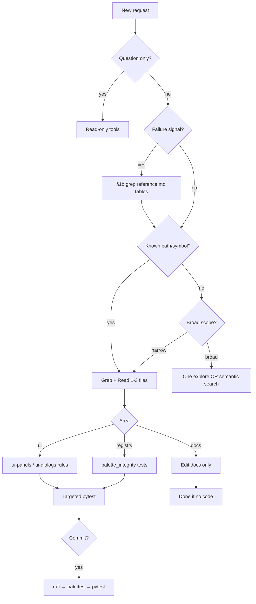

# Agent Triage — Reference

**Repo routing index:** [AGENTS.md](../../AGENTS.md). **Always-on wrapper:** [agent-routing.mdc](../../rules/agent-routing.mdc).

Quick lookup for path→test mapping and entry points. Source of truth for hooks: `scripts/pre-commit-pytest.sh`.

## Classify the request (signals)

| Mode | User signals (examples) |
| ---- | ------------------------ |
| **Read-only** | explain, review, audit, "is this correct?" |
| **Surgical** | fix one error, rename, small doc fix; bug found / fix bug / bug reported; failing test, ruff/lint, typo, quick fix |
| **Implementation** | feature, multi-file, refactor (no kanban card named) |
| **Review first, then implement** | kanban, card path/title/id, "implement from card", first To Do card |
| **Unblock** | pre-commit failed, hook error |
| **Verify** | run tests, commit-ready, staged pytest |

Ad-hoc bugs → **Surgical**. Named **To Do** card → [kanban-markdown](../kanban-markdown/SKILL.md). **Bug** cards: [kanban-bug-cards.mdc](../../rules/kanban-bug-cards.mdc). **Inquiry** cards: research + **Response** — [kanban-inquiry-cards.mdc](../../rules/kanban-inquiry-cards.mdc).

## Failure pattern routing (grep on signals only)

Run after §1 classifies a **failure** — not on every turn. Grep **Trigger snippet** or **Signature** in the listed `reference.md` § Failure patterns table; apply **Fix pattern** before deep exploration. Schema: [agent-self-evaluation/SKILL.md](../agent-self-evaluation/SKILL.md) §6f. Procedure: [agent-triage/SKILL.md](SKILL.md) §1b.

| Failure signal (§1 classify) | Grep in | Example signatures / trigger snippets |
| ---------------------------- | ------- | --------------------------------------- |
| Pre-commit / hook / ruff / palette validate | [pre-commit-workflow/reference.md](../pre-commit-workflow/reference.md) § Failure patterns | `precommit-stash-old-hooks`, `precommit-pytest-scope-mismatch`, `validate-palettes`, `ruff` |
| Pytest scope / hook surprise / hardcoded counts | [pre-commit-workflow/reference.md](../pre-commit-workflow/reference.md) + [agent-self-evaluation/reference.md](../agent-self-evaluation/reference.md) § Common failure patterns | `precommit-pytest-scope-mismatch`, `palette-hardcoded-count`, `FAILED tests/` |
| UI wiring / dialog / persist | [agent-self-evaluation/reference.md](../agent-self-evaluation/reference.md) § Common failure patterns | `ui-dialog-no-persist`, `_persist_dialog_changes` |
| Worldgen / placement / functional blocks | [agent-self-evaluation/reference.md](../agent-self-evaluation/reference.md) + `.cursor/rules/worldgen.mdc` | `residence` stage 1 for chest NBT tests (see worldgen rule) |
| Agent handoff / kanban / AGENTS.md / self-eval | [agent-self-evaluation/reference.md](../agent-self-evaluation/reference.md) § Common failure patterns | `self-eval-skipped`, `kanban-roadmap-queue`, `agents-md-stale`, `handoff-missing-files-context` |
| Structure YAML paths | [agent-self-evaluation/reference.md](../agent-self-evaluation/reference.md) § Common failure patterns | `yaml-stage1-structure-yaml`, `stage1/structure.yaml` |

**No match:** proceed with normal discovery; note recurring failures for self-eval §6 churn.

### Example — pre-commit failure

```text
User: commit failed on pytest; no commit-issue card in .devtool/features/

1. Classify → Unblock / pre-commit failed
2. Grep:
     rg "commit-issue|precommit-stash|FAILED" .cursor/skills/pre-commit-workflow/reference.md
     rg "precommit-" .cursor/skills/agent-self-evaluation/reference.md
3. Match precommit-stash-old-hooks → stage hook scripts + pre-commit install
4. Else match precommit-pytest-scope-mismatch → scripts/pre-commit-pytest.sh on staged paths
5. Open pre-commit-workflow/SKILL.md for hook order; commit-issue card rule if capture expected
```

## Entry points

| Concern | Module / doc |
| ------- | ------------- |
| Render pipeline | `render_main.py` → `renderers/registry.py` |
| Structure load/save | `helpers/structure_loader.py`, `ui/document.py` |
| Block registry | `registries/loader.py`, `helpers/registry_lookup.py` |
| Palette / picker UI | `helpers/block_picker.py`, `ui/widgets/palette_panel.py` |
| Grid editing | `ui/widgets/grid.py`, `ui/main_window.py` (orchestration) |
| Site / paths | `helpers/path_geometry.py`, `helpers/site_ground.py`, `ui/widgets/site_grid.py` |
| Worldgen export | `renderers/worldgen.py`, `helpers/worldgen_*.py` |
| Token grammar | `helpers/structure_tokens.py`, `docs/structure-tokens.md` |

## Common path → pytest mapping

Use `.venv/bin/pytest … -q` from repo root.

| Changed path(s) | Start with |
| --------------- | ---------- |
| `helpers/cells.py` | `tests/test_cells.py` |
| `helpers/block_picker.py`, `helpers/registry_*.py` | `tests/test_block_picker.py`, `tests/test_palette_integrity.py` |
| `helpers/materials.py` | `tests/test_materials.py` |
| `helpers/structure_loader.py`, `helpers/structure_tokens.py` | `tests/test_structure_loader.py`, `tests/test_structure_tokens.py` |
| `helpers/path_geometry.py`, `helpers/path_strip.py` | `tests/test_path_geometry.py`, `tests/test_path_strip.py` |
| `registries/**` | `tests/test_palette_integrity.py`, `tests/test_registry_phase_b.py` |
| `ui/document.py`, `ui/editor_*.py` | `tests/test_ui_document.py` |
| `ui/widgets/palette_panel.py` | `tests/test_palette_panel.py` |
| `ui/widgets/grid.py` | `tests/test_grid_scrollbars.py` + grid-related tests |
| `ui/main_window.py` | `tests/test_main_window.py` |
| `renderers/worldgen.py`, `helpers/worldgen_*.py` | `tests/test_worldgen_*.py` (see pre-commit script list) |
| `helpers/paths.py`, `helpers/structure_loader.py` | `tests/test_paths.py`, `tests/test_structure_loader.py`, `tests/test_worldgen_functional_blocks.py` |
| `docs/**` only | *(none)* |

When in doubt, grep `scripts/pre-commit-pytest.sh` for the file you changed.

## Before commit

Run `scripts/pre-commit-pytest.sh` on **staged** files — same script as the hook. After fixing a failure, re-run that script (or full suite if it says full suite), not only the single failed test file. See [targeted-testing](../targeted-testing/SKILL.md) §5–§6.

## Forces full pytest suite (pre-commit)

These staged paths trigger **full suite** in the hook:

- `tests/conftest.py`, `pyproject.toml`, `render_main.py`
- `helpers/context.py`, `registries/loader.py`, `helpers/utils.py`

## UI file size hints

| File | Note |
| ---- | ---- |
| `ui/main_window.py` | Orchestration only — grep for handler name; avoid full read |
| `ui/widgets/grid.py` | Large — read targeted line ranges |
| `ui/document.py` | Manifest + stage save logic |

## Qt tests

PySide6 tests may segfault in sandboxed shells. If pytest dies with SIGSEGV on UI tests, rerun with full permissions or run the specific UI test file locally.

## Decision flow


