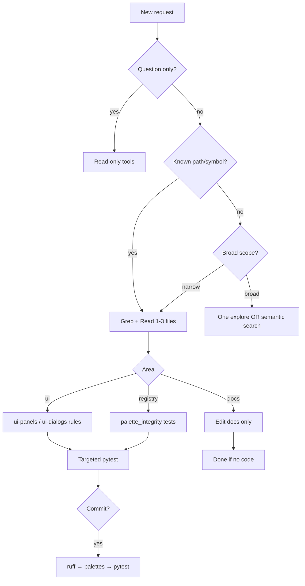

# Agent Triage — Reference

Quick lookup for path→test mapping and entry points. Source of truth for hooks: `scripts/pre-commit-pytest.sh`.

## Entry points

| Concern | Module / doc |
| ------- | ------------- |
| Render pipeline | `render_main.py` → `renderers/registry.py` |
| Structure load/save | `helpers/structure_loader.py`, `ui/document.py` |
| Block registry | `registries/loader.py`, `helpers/registry_lookup.py` |
| Palette / picker UI | `helpers/block_picker.py`, `ui/widgets/palette_panel.py` |
| Grid editing | `ui/widgets/grid.py`, `ui/main_window.py` (orchestration) |
| Site / paths | `helpers/path_geometry.py`, `helpers/site_ground.py`, `ui/widgets/site_grid.py` |
| Worldgen export | `renderers/worldgen.py`, `helpers/worldgen_*.py` |
| Token grammar | `helpers/structure_tokens.py`, `docs/structure-tokens.md` |

## Common path → pytest mapping

Use `.venv/bin/pytest … -q` from repo root.

| Changed path(s) | Start with |
| --------------- | ---------- |
| `helpers/cells.py` | `tests/test_cells.py` |
| `helpers/block_picker.py`, `helpers/registry_*.py` | `tests/test_block_picker.py`, `tests/test_palette_integrity.py` |
| `helpers/materials.py` | `tests/test_materials.py` |
| `helpers/structure_loader.py`, `helpers/structure_tokens.py` | `tests/test_structure_loader.py`, `tests/test_structure_tokens.py` |
| `helpers/path_geometry.py`, `helpers/path_strip.py` | `tests/test_path_geometry.py`, `tests/test_path_strip.py` |
| `registries/**` | `tests/test_palette_integrity.py`, `tests/test_registry_phase_b.py` |
| `ui/document.py`, `ui/editor_*.py` | `tests/test_ui_document.py` |
| `ui/widgets/palette_panel.py` | `tests/test_palette_panel.py` |
| `ui/widgets/grid.py` | `tests/test_grid_scrollbars.py` + grid-related tests |
| `ui/main_window.py` | `tests/test_main_window.py` |
| `renderers/worldgen.py`, `helpers/worldgen_*.py` | `tests/test_worldgen_*.py` (see pre-commit script list) |
| `helpers/paths.py`, `helpers/structure_loader.py` | `tests/test_paths.py`, `tests/test_structure_loader.py`, `tests/test_worldgen_functional_blocks.py` |
| `docs/**` only | *(none)* |

When in doubt, grep `scripts/pre-commit-pytest.sh` for the file you changed.

## Before commit

Run `scripts/pre-commit-pytest.sh` on **staged** files — same script as the hook. After fixing a failure, re-run that script (or full suite if it says full suite), not only the single failed test file. See [targeted-testing](../targeted-testing/SKILL.md) §5–§6.

## Forces full pytest suite (pre-commit)

These staged paths trigger **full suite** in the hook:

- `tests/conftest.py`, `pyproject.toml`, `render_main.py`
- `helpers/context.py`, `registries/loader.py`, `helpers/utils.py`

## UI file size hints

| File | Note |
| ---- | ---- |
| `ui/main_window.py` | Orchestration only — grep for handler name; avoid full read |
| `ui/widgets/grid.py` | Large — read targeted line ranges |
| `ui/document.py` | Manifest + stage save logic |

## Qt tests

PySide6 tests may segfault in sandboxed shells. If pytest dies with SIGSEGV on UI tests, rerun with full permissions or run the specific UI test file locally.

## Decision flow

